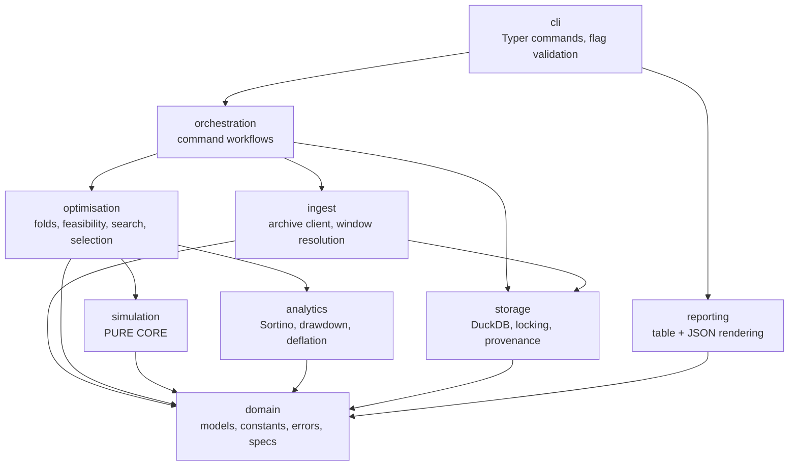
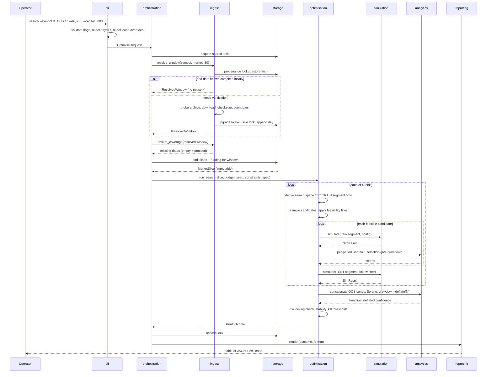
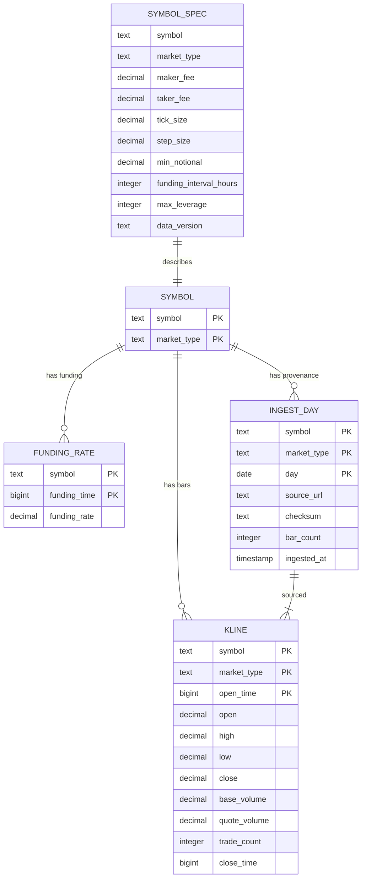

# Solution Design — Binance Trading Bot Optimiser

## Overview

### Description

A single-user Python CLI that resolves a trailing analysis window against the Binance public data archive, ingests 1-minute klines and funding rates into a local DuckDB store, and evaluates Binance Spot Grid and Futures Grid configurations against that history — either measuring one Operator-supplied configuration (`backtest`) or searching for a good one under walk-forward validation (`search`).

The architecture is a **layered monolith with a pure simulation core**. Every design decision below serves one of two goals: making the simulated numbers correct, and making the tool's own uncertainty about those numbers visible. The system is deliberately capable of returning nothing, and of declining to endorse a configuration it has just spent 2,000 trials finding.

**Crypto markets trade 24/7.** Every calendar date is a full 1,440-bar day with no session boundaries, no weekends and no holidays. This materially simplifies the design: date arithmetic is uniform, the completeness test is a single constant, folds map directly onto hour offsets without session-gap handling, and the hourly equity series has no discontinuities. No component contains a trading-calendar abstraction, and none should acquire one.

### Technology Stack

| Concern | Choice | Notes |
|---|---|---|
| Language | Python 3.12+ | Per constitution. |
| Packaging / environments | uv, with committed lockfile | Per constitution. |
| Lint & format | ruff | Per constitution. |
| Type checking | mypy (strict on `domain`, `simulation`, `analytics`) | Strictest where correctness matters most. |
| Testing | pytest | Per constitution. |
| CLI framework | **Typer** | Declarative, type-hint driven, generates help from signatures. Non-interactive by construction — no prompt helpers are used. |
| Store | **DuckDB**, single embedded file | Per constitution. |
| HTTP client | `httpx` | Timeouts, retries and connection reuse; sync API only. |
| Exact arithmetic | `decimal.Decimal` | Accounting path only. |
| Numeric / statistics | `numpy` (+ `scipy.stats` for the normal CDF/quantile) | Post-settlement statistics only, `float64`. |
| Progress / diagnostics | stderr writer | Keeps stdout clean for JSON. |

**Explicitly excluded:** any authenticated Binance SDK, any credential store, any telemetry, Numba/Cython or other compiled toolchains (NFR-009), and any charting library.

### Design Decisions Summary

| # | Decision | One-line rationale |
|---|---|---|
| D1 | Expanding-window walk-forward, 4 folds, 114-hour test segments, 6-hour embargo | Extracts 456 out-of-sample hours from a 30-day window and makes the 50% consistency rule meaningful. |
| D2 | Latin-hypercube sampling, single pass, 500 trials per fold | Hits the trial budget exactly, is unbiased, and reproduces byte-identically from a seed. |
| D3 | Vectorised event detection, exact-arithmetic loop over fills only | Skips the ~95% of bars that touch no grid level while preserving exact accounting. |
| D4 | Single DuckDB file holding klines, funding and provenance | One artefact to manage; columnar compression meets the disk budget comfortably. |
| D5 | Shared-reader / exclusive-writer advisory file lock | Lets an analysis run while another symbol ingests, without risking store corruption. |
| D6 | Results ephemeral; store holds market and reference data only | Follows requirements Deviation D-001. |
| D7 | Reference data packaged as versioned files, not stored in DuckDB | Fee schedules are code-adjacent config, version-controlled and diffable. |
| D8 | Dual-path conservative intrabar resolution | Evaluates both feasible price paths and keeps the worse outcome — deterministic and testable. |
| D9 | Deflation on per-period Sortino against a best-of-N null benchmark | Makes the multiple-testing haircut computable and the endorsement gate meaningful. |

### Recorded Deviations Carried Forward

**D-001 — Result persistence.** The constitution names DuckDB the system of record for run results, trial counts and derived thresholds; the requirements make results ephemeral. **This design follows the requirements**: the DuckDB store contains market data, funding rates and ingest provenance only. No table exists for results, rankings, trials or thresholds, and none should be added without amending both documents. The constitution's *Integration Points → DuckDB* section remains to be amended to match.

**D-002 — Fold viability is a reporting signal, not a discard gate.** Constitution Principle 2 states that a fold is "reportable only if it contains at least a minimum number of completed grid cycles". The requirements instead retain every fold and gate only on the aggregate cycle count, because discarding folds in which the strategy stopped cycling would filter out precisely the informative failures and leave a survivor-biased headline. **This design follows the requirements**: thin folds are counted, reported and kept in the concatenated series. Constitution Principle 2's fold-viability clause should be amended to match.

**D-003 — "Non-overlapping" applies to test segments only.** FR-017 specifies "sequential, non-overlapping train/test fold pairs". The expanding-window scheme of D1 produces strictly non-overlapping *test* segments in chronological order, but its *training* segments are nested (hours 0–240, 0–360, 0–480, 0–600). **This design accepts the divergence deliberately** — see D1 for why an expanding window is preferred over a rolling one at this sample size — and accounts for its two consequences explicitly:

- Nested training data makes fold winners **positively correlated**, so "won 3 of 4 folds" is weaker evidence of persistence than four independent selections would be. The trust context therefore reports the training scheme alongside the selection-stability figures, and the human-readable output states that consistency is measured across nested training windows.
- The **effective** number of independent trials behind deflation is lower than the nominal 2,000. Deflation still uses the full nominal count, which is the conservative direction: a larger N produces a higher null benchmark and therefore a harder gate to clear.

---

## High-Level Architecture Design

Dependencies point strictly downward. The `simulation` core sits at the bottom of the analytical stack and cannot reach the network, the filesystem, the clock, or the database — which is what makes the no-lookahead invariant (FR-012) structurally enforceable rather than merely forbidden.



Rules enforced by an import-linter contract in CI:

- Nothing imports `cli` or `orchestration`.
- `simulation` and `analytics` import only `domain` and the standard library (plus `numpy`/`scipy` for `analytics`).
- Only `ingest` performs network I/O. Only `storage` opens the database or takes locks.
- `simulation` receives market data as a bounded, immutable, chronologically ordered slice — never a query handle.

### Optimise Run — Sequence



---

## System Modules

### `domain`

**Responsibilities.** Own every shared type, constant and error class, plus the packaged symbol reference data. Contains no logic beyond validation. Has no dependencies, which is what allows every other module to depend on it without creating cycles.

**Key components.**

- `models`: frozen dataclasses — `SpotGridConfig`, `FuturesGridConfig`, `MarketSlice`, `Bar`, `Fill`, `SimResult`, `FoldPlan`, `FoldResult`, `RunOutcome`, `ResolvedWindow`, `SymbolSpec`.
- `constants`: every named constant, in one module. No literal governing behaviour appears anywhere else. The inventory extends the requirements' constants table with the design-level constants introduced here:

| Constant | Value | Overridable | Introduced by |
|---|---|---|---|
| `FOLD_COUNT` | 4 | no | D1 |
| `TRAIN_INITIAL_HOURS` | 240 | no | D1 |
| `TEST_BLOCK_HOURS` | 120 | no | D1 |
| `EMBARGO_HOURS` | 6 | no | D1 |
| `GRID_COUNT_LADDER` | 4, 6, 8, 10, 12, 16, 20, 24, 32, 40, 48, 64, 80, 96, 128, 160 | no | `search` search space only. Capped at 160 to stay below both dynamic-order thresholds: a search must not select a winner whose mechanics the engine models wrongly |
| `GRID_COUNT_MIN` | 4 | no | the floor for a grid configuration on either market |
| `GRID_COUNT_MAX_SPOT` / `_FUTURES` | 500 / 169 | no | the ceiling `GridConfig` validates `grids` against, per market. Replaced the single derived `GRID_COUNT_MAX`, which conflated the search ladder's extent with a venue constraint |
| `DYNAMIC_ORDER_THRESHOLD_SPOT` / `_FUTURES` | 170 / 169 | no | above these Binance rests only that many orders around price and repositions them; this engine rests every level. `backtest` and `sweep` may cross it and disclose; `search` may not |
| `SWEEP_GRID_LADDER_SPOT` / `_FUTURES` | 4, 8, …, 256, 500 / 4, 8, …, 128, 169 | no | `sweep` enumerates these exhaustively. Deliberately crosses the spot threshold; no power-of-two length requirement, since nothing samples them |
| `LEVERAGE_MIN` / `LEVERAGE_MAX_DEFAULT` | 1 / 5 | no | search space, further clamped by `SymbolSpec.max_leverage` |
| `RANGE_HALF_WIDTH_MIN_MULTIPLE` / `_MAX_MULTIPLE` | 0.25 / 2.0 | no | search space; **coupled to `SELECTION_MIN_CYCLES_PER_DAY`** — the wide end is only safe while the activity gate holds |
| `SELECTION_MIN_CYCLES_PER_DAY` | 3.0 | no | activity gate applied to a candidate's **training** segment; **coupled to `RANGE_HALF_WIDTH_MAX_MULTIPLE`** |
| `MIN_CYCLE_RATE_FRACTION` | 0.5 | no | invalidation threshold derivation — the *reported* floor, distinct from the activity gate above |
| `MAX_INFEASIBLE_DRAW_RATIO` | 10× budget | no | sampler draw bound |
| `ANNUALISATION_PERIODS` | 8,760 | no | hourly → annual scaling |
| `DEFLATION_FIXTURE_TOLERANCE` | 0.001 | no | test-fixture comparison tolerance |

- `errors`: hierarchy rooted at `OptimiserError`, split into `OperationalError` (exit 1) and `UsageError` (exit 2). Research findings are deliberately not exceptions — they are ordinary return values.
- `money`: the `Decimal` context, quantisation helpers bound to instrument tick and step size, and `settle()`, the single conversion boundary to `float64`.
- `specs`: loader for the packaged symbol reference data (D7), exposing the supported symbol set and each `SymbolSpec`.

**Key interfaces.**

```
Config.validate() -> None            # raises UsageError; called in __post_init__
MarketSlice.window() -> (start, end)
settle(Decimal) -> float             # the ONLY Decimal -> float conversion
specs.supported() -> list[SymbolSpec]
specs.get(symbol, market) -> SymbolSpec    # raises OperationalError naming supported set
```

**Data models.** All configuration and result types are frozen and slot-based; validation occurs in `__post_init__`, so an invalid configuration cannot be constructed, let alone simulated.

**Dependencies.** Standard library only.

**Error handling.** Raises `UsageError` on invalid construction. Never catches.

---

### `simulation` — the pure core

**Responsibilities.** Given an immutable market slice and one configuration, produce a deterministic `SimResult`: the fill log, the cash and inventory trajectory, fees, funding, and any liquidation event. This module is the project's credibility.

**Key components.**

- `registry`: maps a strategy identifier to its implementation. Adding a strategy requires no change elsewhere (FR-011).
- `spot_grid`, `futures_grid`: the two registered strategies.
- `levels`: grid level construction (arithmetic and geometric spacing) and allocation-profile distribution.
- `events`: **vectorised event detection**. Levels are sorted once; `numpy.searchsorted` against each bar's low and high yields the index range of levels touched. Bars touching no level — typically the large majority — are skipped entirely without entering the accounting loop.
- `engine`: the stateful loop, which iterates **only over bars flagged as event-bearing**, applies conservative intrabar resolution, updates resting orders, and accumulates cash, inventory, fees and funding in `Decimal`.
- `equity`: reconstructs the hourly mark-to-market equity series from the fill log after settlement, in `float64`.

**Key interfaces.**

```
simulate(slice: MarketSlice, config: StrategyConfig, spec: SymbolSpec) -> SimResult
Strategy.derive_space(train: MarketSlice, spec: SymbolSpec) -> SearchSpace
Strategy.initial_orders(config, first_bar) -> list[RestingOrder]
Strategy.on_fill(state, fill) -> list[OrderAction]
```

**Conservative intrabar resolution (D8).** A 1-minute bar reports open, high, low and close but not the path between them. Where a bar touches more than one grid level, the engine evaluates **both feasible monotone paths** — open→low→high→close and open→high→low→close — and retains the state and PnL of whichever yields the **lower** closing equity. For futures, if *either* path reaches the liquidation price, liquidation occurs. Evaluating both paths costs nothing meaningful because it happens only on event-bearing bars, and it makes the pessimism rule concrete, deterministic and directly testable rather than a matter of judgement.

**Simulation start state.** Every simulation — training segment, test segment or whole-window backtest — begins from a **flat inventory position holding the full total capital in the quote asset**. The simulator has no notion of a prior position.

**Dependencies.** `domain` only. No I/O of any kind — no network, no filesystem, no database handle, no clock read, no randomness.

**Error handling.** Raises only on violated internal invariants, which are bugs rather than conditions. Market conditions — no fills at all, immediate range exit, liquidation on the first bar — are ordinary results.

---

### `analytics`

**Responsibilities.** Compute every statistic downstream of settlement: the Sortino ratio, both drawdown measurements, and the deflated confidence.

**Key components.**

- `sortino`: **per-period** Sortino over hourly returns; downside threshold zero; risk-free zero. Returns an explicit `UNDEFINED` sentinel when downside deviation is zero — never silently coerced to a large number.
- `drawdown`: largest peak-to-trough decline of an hourly equity curve as a fraction of total capital. Three labelled bases: `training_segment` (selection gate), `concatenated_out_of_sample` (reported, search) and `whole_window` (reported, backtest).
- `deflation`: trial-count-aware scoring (D9).

#### Scaling convention — stated once

**All internal computation uses per-period (hourly) ratios. Annualisation is applied only at the point of display**, by multiplying by `sqrt(ANNUALISATION_PERIODS)` = `sqrt(8760)` ≈ 93.59. This matters: the deflation formula's `sqrt(T − 1)` term assumes a per-period ratio, and feeding it an annualised one would inflate the argument of Φ by roughly two orders of magnitude, driving every confidence to ≈ 1.0 and silently disabling the endorsement gate. Function signatures make the convention explicit — `sortino_per_period()` and `annualise()` are separate calls, and the deflation entry point accepts only per-period inputs.

#### Deflation method (D9)

Inputs, all referring to the **same out-of-sample return series** except where stated:

- `r`: the concatenated out-of-sample hourly return series; `T = len(r)` = 456 under D1.
- `R_obs`: the **per-period** Sortino of `r`.
- `V`: the variance of the **per-period training-segment Sortino ratios of all evaluated candidates** across all folds that produced a defined ratio.
- `N`: the total trial count (nominal 2,000).
- `γ₃`, `γ₄`: skewness and kurtosis of `r`.

Step 1 — the benchmark a null-skill search of this size would be expected to produce:

```
R* = sqrt(V) × [ (1 − γ)·Z⁻¹(1 − 1/N) + γ·Z⁻¹(1 − 1/(N·e)) ]
```

with `γ` the Euler–Mascheroni constant (0.5772) and `Z⁻¹` the inverse standard normal CDF.

Step 2 — the confidence that the true ratio exceeds that benchmark:

```
confidence = Φ( (R_obs − R*)·sqrt(T − 1) / sqrt(1 − γ₃·R_obs + ((γ₄ − 1)/4)·R_obs²) )
```

**The denominator is a function of `R_obs`** and must be recomputed for every evaluation — it is not a per-run constant. The two worked examples below differ in denominator for exactly this reason.

**Declared use of an in-sample dispersion proxy.** `V` is drawn from training-segment ratios while `R_obs` is out-of-sample. This is deliberate: `V` must describe the dispersion of the *search* — how much variation the selection procedure had to choose from — and only the training-segment scores participated in selection. The mismatch is stated in the output rather than hidden. The alternative, using the dispersion of the four fold-winner out-of-sample ratios, has too few observations to estimate a variance.

**Semantics, reconciled with FR-019.** FR-019 requires "a confidence that the configuration's true risk-adjusted performance exceeds zero, given the size of the search". `R*` is the operationalisation of *zero true skill given N trials*: it is the ratio a search of this size would be expected to surface from pure noise. The reported quantity is therefore **the probability that the configuration has non-zero true skill after accounting for the size of the search**, and the reporting layer labels it exactly that way rather than as a raw probability of positive return.

#### Worked examples (fixtures for the analytics test suite)

Common terms with `N = 2,000`: `Z⁻¹(1 − 1/2000) = Z⁻¹(0.99950) ≈ 3.2905`; `Z⁻¹(1 − 1/(2000e)) = Z⁻¹(0.999816) ≈ 3.5630`; bracket = `0.4228 × 3.2905 + 0.5772 × 3.5630 ≈ 3.4478`. Both examples take `sqrt(V) = 0.015`, giving `R* ≈ 0.05172` per period, and `γ₃ = −0.4`, `γ₄ = 6`, `T = 456` (so `sqrt(T − 1) ≈ 21.331`).

**Example A — a winner that fails the gate.**

- Observed annualised Sortino 2.41 → `R_obs = 2.41 / 93.59 ≈ 0.02575`.
- Denominator: `sqrt(1 + 0.4×0.02575 + 1.25×0.02575²)` = `sqrt(1 + 0.01030 + 0.00083)` ≈ **1.00555**.
- Numerator: `(0.02575 − 0.05172) × 21.331` ≈ **−0.5540**.
- Argument ≈ **−0.551** → **confidence ≈ 0.291**.

Below the 0.95 threshold, so the outcome is a research finding with cause `not_distinguishable_from_search_noise`.

**Example B — a winner that clears it, barely.**

- Observed annualised Sortino 12.4 → `R_obs = 12.4 / 93.59 ≈ 0.13249`.
- Denominator: `sqrt(1 + 0.4×0.13249 + 1.25×0.13249²)` = `sqrt(1 + 0.05300 + 0.02194)` ≈ **1.03680** — materially larger than Example A's, because the third and fourth moment terms scale with `R_obs`.
- Numerator: `(0.13249 − 0.05172) × 21.331` ≈ **1.7229**.
- Argument ≈ **1.662** → **confidence ≈ 0.952**.

This clears the 0.95 minimum deflation confidence by roughly **0.002** — an extremely narrow margin, and a useful illustration of how demanding a best-of-2,000 haircut is. A configuration must post an annualised out-of-sample Sortino above about 12 to be endorsable at this trial count and this dispersion.

Both examples are committed as analytics fixtures and asserted to within `DEFLATION_FIXTURE_TOLERANCE` (±0.001), so the tests are not brittle against implementation differences in Φ across library versions.

**Design note on gate severity.** Example A is the expected common case, and that is intentional: best-of-2,000 is a high bar, and the constitution's first principle prefers refusing to answer over answering wrongly. If field measurement shows the gate is effectively never clearable, **the correct response is to reduce the trial budget, not to lower the deflation threshold** — a smaller search produces a lower null benchmark honestly, whereas a lowered threshold merely conceals the multiple-testing burden. Both constants are marked provisional pending measurement.

**Key interfaces.**

```
sortino_per_period(returns: ndarray) -> float | UNDEFINED
annualise(per_period: float) -> float
max_drawdown(equity: ndarray, capital: float) -> float
deflated_confidence(r_obs_per_period, trial_ratio_variance, oos_returns, n_trials) -> float
```

**Dependencies.** `domain`, `numpy`, `scipy.stats`.

**Error handling.** Degenerate inputs return explicit sentinels, never `inf` or `nan` silently propagated. Fewer than two observations is a programming error.

---

### `optimisation`

**Responsibilities.** Divide the window into folds, derive per-fold search spaces, enforce venue feasibility, sample and evaluate candidates within budget, select fold winners, assemble the out-of-sample series, apply the risk-ceiling check, compute stability, and derive invalidation thresholds.

**Key components.**

##### `folds` — expanding window with embargo (D1)

The 30-day window is 720 hours. Test blocks occupy hours [240, 360), [360, 480), [480, 600), [600, 720). For fold *k* (1-indexed):

- **train** = hours `[0, 240 + 120(k − 1))` — nested, growing 240 → 600 hours.
- **embargo** = the first `EMBARGO_HOURS` (6) of the test block, excluded from both training and test.
- **test** = the remaining 114 hours of the block.

Four folds, **456 out-of-sample hours** in total, no session-gap handling required because the market is continuous. Test segments are strictly non-overlapping and chronological; training segments are nested, which is recorded as Deviation D-003.

**Why an embargo.** The classic purging problem — training labels drawn from a forward window that overlaps the test period — does not arise here, because grid selection scores a candidate on its realised simulated performance within the training segment rather than on a forward-looking label. What does arise is serial correlation: volatility and price level at hour 240 are near-identical to hour 241, so a configuration fitted to the end of training would begin its test period in conditions it was effectively fitted on. Six hours is short relative to the 114-hour test segment (5% of it) but long relative to the autocorrelation of hourly crypto volatility, which is the leakage this closes.

##### `feasibility` — venue constraints (IR-003)

Applied at candidate construction, before any simulation, using the `SymbolSpec`:

1. **Snap** price bounds to `tick_size` and derived per-level order quantities to `step_size`.
2. **Clamp** the sampled leverage dimension to `min(LEVERAGE_MAX_DEFAULT, spec.max_leverage)`.
3. **Reject** any candidate whose smallest per-level order — under the allocation profile applied to the Operator's total capital — falls below `spec.min_notional`. With a 5,000-unit capital and 160 grids this is a routine rejection, not an edge case.

The same filter is applied to a `backtest` configuration, where a violation is a `UsageError` (exit 2) naming the offending parameter and the binding limit, because the Operator supplied it directly.

**Infeasible candidates do not consume the trial budget.** They are re-drawn rather than counted. The reasoning is that the trial count exists to quantify the *selection* burden for deflation, and a candidate rejected before simulation was never a selection opportunity — counting it would inflate `N`, raise the null benchmark, and make the gate harder to clear for a reason unrelated to searching. Draws are bounded at `MAX_INFEASIBLE_DRAW_RATIO` × budget to prevent an unsatisfiable space from looping; exhausting that bound is a research finding stating that the capital is too small for the symbol's minimum order size at any grid count in the space. The count of infeasible draws is reported in the trust context.

##### `space` — search space derivation

Derived from the **training segment only**: range bounds from training realised volatility and price extent; grid count uniform over the rungs of `GRID_COUNT_LADDER`; spacing mode; allocation profile; and for futures, leverage and direction. Because each fold derives its space from different training data, sampled parameter values are **snapped to the symbol's tick and step grid** (which is also a common grid across folds), so that a configuration selected in one fold is identifiable as the same configuration in another — without this, selection-frequency counting would be meaningless.

##### `sampler` — Latin-hypercube draw (D2)

Scrambled Sobol sampling over the unit hypercube, mapped through each dimension's distribution, seeded from the run seed and the fold index. Budget allocation: **floor division across folds, with the remainder assigned to the earliest folds** — a budget of 2,002 gives folds of 501, 501, 500, 500. The planned per-fold counts are computed and reported before the run begins, so the trial count is exactly predictable in advance.

##### `counter` — trial accounting

**The trial budget governs candidate evaluations on training segments only.** The four out-of-sample confirmation runs of fold winners are simulations but not trials: they perform no selection, and including them would both breach the declared budget and misstate the multiple-testing burden. They are counted and reported separately as `confirmation_runs`. Every training-segment evaluation passes through the counter; the search cannot evaluate a candidate the counter does not observe.

##### `selection`

Applies the selection-gate drawdown exclusion and the undefined-Sortino exclusion, ranks survivors by per-period training Sortino, and records the fold winner.

##### `assembly`

- Simulates each fold winner on its test segment from a **flat position with the full total capital**.
- Builds the **concatenated out-of-sample equity curve** by chaining the folds' hourly return series in chronological order and compounding them from a single common starting equity equal to total capital. Consecutive declining folds therefore compound into one deeper trough, which is what makes the reported drawdown reflect what an Operator would actually have experienced.
- Marks thin folds, applies the aggregate cycle gate, computes the headline and deflated confidence, runs the risk-ceiling check, computes selection stability, and derives the kill thresholds.

##### Invalidation thresholds — two bases

FR-020 admits no exception for `backtest`, so both derivations are defined on both paths. The formulae are structurally identical; only the source series differs, and the output always states which basis was used.

| | `search` — basis `per_fold_out_of_sample` | `backtest` — basis `whole_window` |
|---|---|---|
| **Drawdown kill threshold** | tighter of (worst **per-fold out-of-sample** drawdown + `drawdown kill-threshold margin`) and the applied maximum-drawdown limit | tighter of (**whole-window** drawdown + the same margin) and the applied maximum-drawdown limit |
| **Minimum grid-cycle rate** | `MIN_CYCLE_RATE_FRACTION` × realised **out-of-sample** completed cycles per day | `MIN_CYCLE_RATE_FRACTION` × realised **whole-window** completed cycles per day |

A live bot cycling at less than half the rate its evaluation produced has met a market that no longer suits it — the reasoning holds identically whichever series the rate was measured over. Both thresholds appear in both output formats on every result carrying performance metrics, including a `backtest` result and a result downgraded by the risk-ceiling check. The JSON payload carries `invalidation.basis` so a consumer never has to infer which series a threshold came from.

**Key interfaces.**

```
run_search(slice, budget, seed, constraints, spec, overrides) -> RunOutcome
FoldPlan.segments() -> list[(train_slice, embargo_hours, test_slice)]
feasibility.check(config, spec, capital) -> Feasible | Rejection
invalidation.derive(equity_series, cycles_per_day, applied_limit, basis, overrides) -> Thresholds
```

**Data models.** Produces `RunOutcome`, a discriminated union: `EndorsedResult`, `MeasuredResult`, `ResearchFinding(cause)` where cause is one of `no_viable_configuration`, `insufficient_oos_evidence`, `not_distinguishable_from_search_noise`, `risk_ceiling_breached`, `capital_below_venue_minimum`.

**Dependencies.** `domain`, `simulation`, `analytics`.

**Error handling.** Every "nothing useful" path returns a `ResearchFinding` carrying full diagnostics — trials evaluated, confirmation runs, infeasible draws, per-gate rejection counts, best selection-gate drawdown achieved, and a specific relaxed drawdown value that would have admitted a candidate.

---

### `ingest`

**Responsibilities.** Resolve the analysis window, acquire absent data, verify it, and hand it to storage. The only module permitted outbound network access.

**Key components.**

- `resolver`: **store-first window resolution (FR-001)**. Consults the provenance table for the most recent locally-held complete date before touching the network. Where the candidate date is absent or short, probes and downloads it, verifies the bar count against 1,440, and steps back a day if incomplete. A fully-covered store therefore resolves with **zero network calls**.
- `client`: `httpx` with explicit connect/read timeouts, bounded retries (3, exponential backoff with jitter), and a modest concurrency cap so the archive is never hammered.
- `verifier`: checksum comparison against the published value; on mismatch, nothing is written.
- `extractor`: defensive ZIP handling — rejects absolute paths, parent-directory traversal, unexpected member names, member counts above one, and uncompressed sizes beyond a sane bound, before any byte is written. Extraction targets a temporary directory inside the data root and is atomically promoted on success. **Downloaded archives are deleted after successful ingest**; the checksum retained in provenance is what supports later verification.
- `coverage`: verifies every interior date of the resolved window is present with a full bar count; produces the explicit missing-date list for FR-004.

**Key interfaces.**

```
resolve_window(symbol, market, days) -> ResolvedWindow
ensure_coverage(window) -> list[date]        # empty means proceed
```

**Dependencies.** `domain`, `storage`, `httpx`.

**Error handling.** All failures are `OperationalError` with the symbol, the date, what was attempted and what to do next. Missing data is never interpolated, never forward-filled, never silently skipped.

---

### `storage`

**Responsibilities.** Own the DuckDB file, the lock, the schema and its migrations. The only module that opens the database.

**Key components.**

- `schema`: table definitions and forward-only, explicit migrations that preserve ingested data.
- `repository`: append-only writes and range reads. `load_slice()` returns an immutable `MarketSlice` for a bounded date range — deliberately not a cursor or query handle, so callers cannot widen their own window.
- `provenance`: source URL, checksum, observed bar count and ingest timestamp per ingested day. The bar count is what lets the resolver work offline.
- `locking`: **shared-reader / exclusive-writer advisory lock (D5)** on a lock file in the data root, via `fcntl.flock`. Analysis takes a shared lock; ingest upgrades to exclusive only for the duration of a write. A run that cannot acquire its lock within a short timeout exits with a clear operational error naming the conflicting operation.

**Key interfaces.**

```
load_slice(symbol, market, start, end) -> MarketSlice
append_day(symbol, market, date, bars, provenance) -> None
covered_dates(symbol, market) -> set[date]
shared_lock() / exclusive_lock()             # context managers
```

**Dependencies.** `domain`, `duckdb`.

**Error handling.** Lock contention, unwritable directory and schema-version mismatch are `OperationalError`. Append is idempotent: re-appending an identical day is a verified no-op; a byte-differing day is rejected rather than silently overwritten.

---

### `reporting`

**Responsibilities.** Render a `RunOutcome` as a human-readable table or as JSON. Contains no analysis and computes no statistic.

**Key components.**

- `table`: plain text, no colour or cursor control. Layout is fixed:
  1. Any downgrade statement or warning — **above** the metrics, never beneath them.
  2. Resolved window, symbol, market type, total capital.
  3. The reported configuration and its metrics.
  4. **The staged-trial guidance line, when and only when `recommendation` is `recommended`.**
  5. Up to `--top` N **distinct fold winners** ordered by selection frequency, ties broken toward the most recent fold's winner. Fewer than N rows appear when fewer distinct winners exist — with four folds there are at most four, so the default N of 10 commonly yields a shorter list, which is expected rather than an error.
  6. Trust context, invalidation thresholds, then disclosures.
  The same ranked list appears in the JSON payload.
- `json`: the versioned envelope of the API section, including the tri-state recommendation field.
- `staged_trial_guidance`: **a distinct, conditional output — not a disclosure.** It carries the constitution's Principle 5 instruction to run the selected configuration at minimum size before scaling, and it is emitted **if and only if `recommendation == "recommended"`**. It is a separate field precisely because it is conditional: the disclosures array is unconditional, and folding a conditional statement into it would either lose the condition or make the array's contents vary for reasons a consumer cannot predict. When the recommendation is `not_recommended` or `not_applicable`, the field is absent from JSON and the line is absent from the table.
- `disclosure`: emits **one entry per row of the constitution's Declared Simulation Assumptions table**, unconditionally — no-slippage grid-price fills; queue position not modelled; conservative intrabar ordering; fees charged on every fill; funding and liquidation modelled for futures; market impact and capacity not modelled and therefore invalid at large capital, scoped to the Operator's stated total capital; short-window regime warning — plus the design-level disclosures: the Sortino-deflation approximation, the in-sample dispersion proxy, and the flat-start assumption at each fold boundary (a live bot carries inventory across, so the concatenated series understates the cost of entering a fold already positioned). A guardrail test asserts one disclosure entry per declared assumption, so the two documents cannot drift apart.

**Dependencies.** `domain`.

---

### `cli` and `orchestration`

**Responsibilities.** Parse and validate flags; sequence the workflow; map outcomes to exit codes.

**Key components.**

- `app`: Typer application exposing `backtest`, `search`, `data status` and `data symbols`. No prompt, no confirmation, no interactive helper is used anywhere.
- `workflows`: the command workflows, each a straight-line function: acquire lock → resolve window → ensure coverage → load slice → analyse → render → exit.
- `progress`: **progress is always written to stderr at intervals of at most 10 seconds, regardless of TTY attachment.** Only the rendering style varies — in-place line update when attached to a terminal, discrete append-only lines otherwise. **stdout is never touched by progress under any condition.**

**Error handling.** The single place exceptions are caught. `UsageError` → exit 2; `OperationalError` → exit 1; every `RunOutcome` including every research finding → exit 0.

---

## Data Model

Persisted entities only. Run results, trials, rankings and thresholds are **not** persisted (D6) and appear here solely to make that absence explicit.



**KLINE.** One row per 1-minute bar. Primary key `(symbol, market_type, open_time)` makes duplicates impossible. Prices and volumes are stored as `DECIMAL` at a declared scale sufficient to represent archive values exactly, so a round-trip through storage is lossless. Because the market is continuous, a complete day is always exactly 1,440 rows.

**FUNDING_RATE.** USD-M futures only, one row per funding interval. Absence within the resolved window is a coverage failure.

**INGEST_DAY.** The provenance record and the enabler of offline window resolution. `bar_count` lets the resolver establish completeness without a network call; `checksum` allows later verification that stored data still matches the archive, which is why the downloaded ZIP itself need not be retained.

**SYMBOL_SPEC.** **Not a database table** — shown here because it is a first-class entity the design depends on. It is packaged with the code as a versioned data file (D7) and loaded at startup. It defines both the supported symbol set (DR-004) and the venue constraints the `feasibility` filter enforces (IR-003). `data_version` is recorded in every result so a captured result stays interpretable after Binance changes its schedules.

**Not persisted:** `RunOutcome`, `FoldResult`, trial counts, rankings, deflated statistics, derived thresholds, search spaces and seeds — all constructed in memory and rendered to stdout.

---

## API / Protocol Design

There is no network API. The contract is the CLI surface, the JSON payload on stdout, and the exit codes.

### Command Surface

```
optimiser backtest  --symbol SYM --market {spot|futures} --days {7|30}
                    --capital AMOUNT [--max-drawdown FRACTION]
                    --lower PRICE --upper PRICE --grids N
                    --spacing {arithmetic|geometric}
                    [--allocation uniform]
                    [--leverage N] [--direction {long|short|neutral}]
                    [--kill-drawdown FRACTION] [--min-cycle-rate PER_DAY]
                    [--json] [--data-dir PATH]

optimiser search  --symbol SYM --market {spot|futures} --days 30
                    --capital AMOUNT [--max-drawdown FRACTION]
                    [--max-trials N] [--seed N] [--top N]
                    [--kill-drawdown FRACTION] [--min-cycle-rate PER_DAY]
                    [--json] [--data-dir PATH]

optimiser data status  [--json] [--data-dir PATH]
optimiser data symbols [--json]
```

- `--leverage` and `--direction` are futures-only and rejected for spot.
- `search --days 7` is rejected with an explanation pointing to `backtest`.
- **`--kill-drawdown` looser than the applied maximum-drawdown limit is rejected as a usage error** (exit 2) with an explanation, per FR-020 and constitution Principle 4. An honoured override sets `invalidation.source` to `supplied`.
- `data symbols` lists the supported symbol set with market type, tick size, step size, minimum notional and maximum leverage, satisfying DR-004's discoverability requirement. Unsupported-symbol errors name the same set.
- Every other input has a documented default from the constants inventory. No command prompts.

### JSON Envelope

```json
{
  "schema_version": "1.0",
  "command": "search",
  "outcome": "endorsed_result",
  "recommendation": "recommended",
  "cause": null,
  "run": {
    "symbol": "BTCUSDT",
    "market_type": "futures",
    "resolved_window": { "start": "2026-07-22", "end": "2026-08-20", "days": 30 },
    "reference_data_version": "2026.08.1",
    "seed": 8675309,
    "trial_budget": 2000,
    "trials_evaluated": 2000,
    "confirmation_runs": 4,
    "infeasible_draws": 3184
  },
  "folds": {
    "count": 4,
    "scheme": "expanding",
    "train_hours": [240, 360, 480, 600],
    "embargo_hours": 6,
    "test_hours_each": 114,
    "oos_hours_total": 456
  },
  "configuration": {
    "lower": "58000.0", "upper": "72000.0", "grids": 42,
    "spacing": "geometric", "allocation": "uniform",
    "leverage": 3, "direction": "neutral",
    "total_capital": "5000.00"
  },
  "performance": {
    "headline_sortino_oos_annualised": 12.4,
    "headline_sortino_oos_per_period": 0.13249,
    "deflated_confidence": 0.952,
    "null_benchmark_per_period": 0.05172,
    "net_pnl": "318.44",
    "max_drawdown": { "value": 0.11, "basis": "concatenated_out_of_sample" },
    "applied_max_drawdown_limit": 0.20,
    "completed_cycles": 214,
    "fees_paid": "42.18",
    "funding_paid": "-6.30"
  },
  "trust_context": {
    "folds_total": 4,
    "folds_thin": 1,
    "distinct_fold_winners": 2,
    "folds_won_by_reported": 3,
    "training_scheme": "nested_expanding",
    "selection_stability_caveat": "fold winners are correlated because training windows are nested",
    "in_sample_vs_oos_divergence": 0.31,
    "derived_search_space": { "...": "..." },
    "top_fold_winners": [ { "...": "..." } ]
  },
  "invalidation": {
    "basis": "per_fold_out_of_sample",
    "drawdown_kill_threshold": 0.16,
    "capped_by_risk_limit": false,
    "min_grid_cycle_rate_per_day": 4.2,
    "source": "derived"
  },
  "staged_trial_guidance": "Run this configuration at minimum size before scaling. The simulated fill rate is unverified; compare realised fills and PnL against this result before increasing size.",
  "disclosures": ["..."]
}
```

The sample corresponds to Worked Example B: an annualised out-of-sample Sortino of 12.4 against a null benchmark of 0.05172 per period yields a deflated confidence of 0.952, clearing the 0.95 gate narrowly.

### Field Contracts

| Field | Values | Notes |
|---|---|---|
| `outcome` | `endorsed_result`, `measured_result`, `research_finding`, `operational_error` | The discriminator, present on every payload without exception. |
| `recommendation` | `recommended`, `not_recommended`, `not_applicable` | Tri-state. **Omitted entirely from `operational_error` payloads**, matching FR-025's outcome table — no analysis ran, so there is no stance to report, and `outcome` alone is sufficient for a caller to branch. Present on all three other outcomes. `backtest`, `data status` and `data symbols` always emit `not_applicable`. |
| `cause` | `null`, `no_viable_configuration`, `insufficient_oos_evidence`, `not_distinguishable_from_search_noise`, `risk_ceiling_breached`, `capital_below_venue_minimum` | Non-null only for research findings. |
| `max_drawdown.basis` | `training_segment`, `concatenated_out_of_sample`, `whole_window` | Every drawdown states its basis. |
| `invalidation.basis` | `per_fold_out_of_sample`, `whole_window` | Which series the kill thresholds were derived from. |
| `invalidation.source` | `derived`, `supplied` | `supplied` when an override flag was honoured. |
| `staged_trial_guidance` | string | Present **if and only if** `recommendation == "recommended"`. Absent otherwise. |

### Exit Codes

| Code | Meaning | Requirements examples mapped here |
|---|---|---|
| 0 | Success — endorsed result, measured result, or any research finding. | All FR-025 result and research-finding rows. |
| 1 | Operational error — environment or data. | Interior missing archive day; insufficient archive history; checksum failure; corrupt archive; unwritable data directory; lock contention; archive unreachable; **unsupported symbol**. |
| 2 | Usage error — malformed or contradictory input. | Invalid or missing flags; `search --days 7`; futures-only flags on spot; `--kill-drawdown` looser than the applied limit; a `backtest` configuration violating venue constraints. |

FR-025 groups both failure classes as "operational error"; this design refines that single category into 1 and 2, with the mapping above as the authoritative allocation. **Unsupported symbol is exit 1**, matching DR-004's classification, even though it arrives as a flag value. Both failure classes omit `recommendation`, consistent with the Field Contracts table.

Stdout carries the payload; stderr carries progress and diagnostics. When `--json` is set, stdout contains valid JSON and nothing else.

---

## Security Architecture

### Authentication and Authorisation

**There is none, by design, and its absence is the primary control.** The tool holds no credential, contacts no authenticated endpoint, and links no order-capable dependency. A full compromise of the process cannot reach the Operator's Binance account, because the process has no means of doing so. Access control over the data directory is delegated to operating-system file permissions.

A CI check asserts that no authenticated Binance SDK, keyring, or credential-handling library appears anywhere in the resolved dependency tree. This is a build-breaking gate, not a review convention.

### Input Validation

Everything crossing the boundary from the archive is untrusted:

- **Transport:** HTTPS only, certificate verification never disabled, explicit connect and read timeouts.
- **Checksum:** verified before any content is parsed; mismatch writes nothing.
- **Archive extraction:** member count capped at one; absolute paths, `..` traversal and unexpected member names rejected; uncompressed size capped against decompression bombs; extraction into a temporary directory inside the data root, atomically promoted only on full success, and the archive deleted afterwards.
- **CSV parsing:** strict typing, explicit column count, rejection of malformed rows rather than coercion. A row that does not parse fails the day; it is never skipped.
- **Flags:** validated by Typer's type system, then by `__post_init__` on the domain models, then by the `feasibility` filter against the venue's own constraints — so an invalid or unplaceable configuration cannot reach the simulator.

### Data Protection

- All state — DuckDB file, lock file, temporary extraction directory — lives beneath the Operator-specified data root. A test asserts, via filesystem monitoring across a full ingest-and-search cycle, that nothing is written outside it.
- All data handled is public market data. There is no personal data, no account data, and therefore no retention or erasure obligation.
- No telemetry, no crash reporting, no outbound transmission of anything. The only outbound requests are archive fetches.

---

## Deployment & Operations

### Infrastructure Layout

None. The tool is a single Python package installed on the Operator's machine, running as a foreground process against a local directory. There is no server, no daemon, no scheduler, no container requirement and no network listener.

```
$DATA_DIR/
  market.duckdb        # klines, funding, provenance
  .lock                # advisory lock file
  tmp/                 # extraction scratch, cleared on success
```

Installation is `uv tool install` (or `uvx` for one-off use) from the built wheel. The lockfile pins every dependency, so a clean environment reproduces exactly.

### Scaling Strategy

Scaling is bounded by design rather than by infrastructure. The trial budget is the primary cost control: a run's cost is `budget × average simulation cost`, and the budget is declared before the run starts and reported with the result.

Deliberate non-goals: no multiprocessing in v1 — the event-detection optimisation (D3) is expected to make the default budget tractable single-process, and parallelism would complicate the determinism guarantee. Should profiling prove it necessary, the natural axis is per-fold parallelism with per-fold seeds, which preserves reproducibility.

The dominant cost of a first run is network, not compute, and it is paid once — the store-first resolver and incremental ingest mean repeat runs perform zero downloads.

### Configuration

Flags first; a small set of environment variables for the data directory and log level; no configuration file, consistent with the flag-driven interaction model. Every constant lives in `domain.constants` and is reported with the result where it affected the outcome, so a captured result records the configuration it ran under.

---

## Observability

Modest and local, matching a single-user tool with no operator on call.

- **Progress** to stderr, unconditionally, at intervals never exceeding 10 seconds during ingest and search: bytes downloaded and files remaining during ingest; fold, trials completed and trials remaining during search; and, before a long search begins, the planned per-fold trial counts with an estimated duration.
- **Structured logging** to stderr with conventional levels, default WARNING, raised by flag. Debug logging includes per-fold winner selection, feasibility rejections and gate rejection counts — enough to reconstruct why a run produced a research finding.
- **No metrics endpoint, no traces, no telemetry.** The result payload is the observability surface that matters.
- **Timing goes to stderr only.** No timing value appears in the stdout payload in either format, so stdout is fully deterministic and diffable and NFR-004's byte-identical comparison needs no exclusions at all.

---

## Testing Strategy

Depth is deliberately asymmetric — rigorous where a defect corrupts the numbers, conventional elsewhere.

**Simulation core (deep).**

- *Golden-file tests*: hand-verified scenarios with independently derived fills, fees, inventory and PnL. Changing one requires explicit justification in review.
- *Synthetic series*: flat → zero cycles, zero fees, zero PnL; monotone ramp → exact fill count and direction; clean oscillation across *n* levels → exact matched pairs; range exit → no fills beyond bounds; futures liquidation ramp → liquidation at the computed level.
- *Truncation equivalence* (no-lookahead): simulating a series truncated at bar *T* yields results for bars 0..*T* identical to the full series. Parametrised across every registered strategy.
- *Dual-path property*: on every event-bearing bar, the retained outcome is never better than the alternative path's.
- *Determinism*: repeated runs byte-identical.
- *Numeric boundary*: `settle()` exercised directly; no rounding before settlement; a high-fill-count scenario reconciles exactly against an independent sum, zero tolerance.

**Analytics (deep).** Sortino against hand-computed series; the undefined-downside sentinel; drawdown on curves with known peak-to-trough structure; **the two worked deflation examples committed as fixtures, asserting confidence ≈ 0.291 (Example A) and ≈ 0.952 (Example B) to within `DEFLATION_FIXTURE_TOLERANCE` (±0.001)**; a denominator test asserting the moment-adjustment term is recomputed per `R_obs` rather than cached across evaluations; a scaling-convention test asserting that passing an annualised ratio to the deflation entry point is rejected; deflation monotonicity — confidence falls as `N` rises, all else equal.

**Guardrail behaviour (deep).** Aggregate cycle gate suppresses the headline; `search --days 7` refused, not degraded; selection-gate drawdown excludes rather than penalises; the risk-ceiling check downgrades an otherwise-endorsable result regardless of deflated confidence; thin folds remain in the concatenated series; `backtest` never emits `recommended`; the trial counter observes every training evaluation and the budget is never exceeded; confirmation runs are excluded from the trial count; infeasible candidates are re-drawn and excluded from the count; a `--kill-drawdown` looser than the applied limit is rejected and `invalidation.source` reads `supplied` when honoured; **a `backtest` result carries both invalidation thresholds in both output formats with `invalidation.basis` = `whole_window`**; **`staged_trial_guidance` is present exactly when `recommendation` is `recommended` and absent otherwise**; the empty result carries per-gate rejection counts and a specific relaxed limit; one disclosure entry exists per declared assumption.

**Feasibility (deep).** Price bounds snap to tick size; quantities snap to step size; leverage clamps to `SymbolSpec.max_leverage`; a capital-and-grid-count combination below `min_notional` is rejected; the unsatisfiable-space path produces `capital_below_venue_minimum`.

**Ingest and storage (conventional).** Recorded archive fixtures in, expected rows out. Failure modes: missing day, corrupt ZIP, checksum mismatch, path-traversal member, oversized member, short bar count triggering resolver step-back, lock contention, concurrent reader plus writer.

**End-to-end (conventional).** Against a fixture store with no network: each command, each outcome kind, each exit code, and JSON schema validation of every payload shape — **including the `operational_error` shape, asserting that `recommendation` is absent and `outcome` is present**.

Standing rules: a simulator bug is reproduced as a failing test before it is fixed; no coverage-percentage target — the golden-file, analytics and guardrail suites are the gate.

---

## Success Criteria

| # | Criterion | Target | Traces to |
|---|---|---|---|
| SC-1 | Cold 30-day single-symbol ingest | ≤ 3 minutes at 20 Mbit/s | NFR-001 |
| SC-2 | Warm run against a covered store | **Zero** network requests, window resolution included | FR-002, NFR-001 |
| SC-3 | Peak resident memory, any operation | ≤ 1 GB on an 8 GB machine | NFR-002 |
| SC-4 | Stored market data footprint | ≤ 30 MB per symbol-month | NFR-003 |
| SC-4b | Total data-root footprint after ingest | ≤ 90 MB per symbol-month; measured as the size of `$DATA_DIR` after a one-month single-symbol ingest, with archives deleted post-ingest | NFR-003 |
| SC-5 | Byte-identical stdout for identical inputs | 100%, no exclusions (timing is stderr-only) | NFR-004 |
| SC-6 | Credential-bearing dependencies | Zero, enforced in CI | NFR-005 |
| SC-7 | Progress reporting gap | ≤ 10 seconds, unconditionally, TTY or not | NFR-006 |
| SC-8 | Accounting reconciliation | Exact, zero tolerance | NFR-007 |
| SC-9 | Writes outside the data root | Zero, verified by filesystem monitoring | NFR-008 |
| SC-10 | Test suite on Linux and macOS from a clean lockfile environment | Passes | NFR-009 |
| SC-11 | Default-budget 30-day search run | Completes within a single interactive sitting on a laptop; measured and published, not assumed | Constitution — Performance Targets |
| SC-12 | Every guardrail in the requirements | Has a dedicated passing test | Constitution — Testing Approaches |
| SC-13 | Reported configurations are placeable on Binance | 100% respect tick size, step size, minimum notional and maximum leverage | IR-003 |
| SC-14 | Every result carrying performance metrics carries both invalidation thresholds | 100%, `search` and `backtest` alike, with basis labelled | FR-020 |

---

## Key Solution Decisions

### D1 — Expanding-window walk-forward, 4 folds, 114-hour test segments, 6-hour embargo

**Decision.** Train on nested windows growing 240 → 600 hours; embargo 6 hours; test on the following 114 hours; four folds; 456 out-of-sample hours.

**Rationale.** Thirty days is a scarce sample, and an expanding window uses all of it rather than throwing away early data — the standard argument for expanding over rolling when data is limited. It yields 456 out-of-sample hours against roughly 200 for a three-fold rolling scheme. Four folds makes the 50% selection-consistency rule meaningful: winning two of four says something, where winning one of two says almost nothing. The embargo closes the serial-correlation leak at the training boundary; classic label-purging does not apply because selection scores realised in-segment performance rather than a forward-looking label.

**Alternatives considered.** *Rolling window* adapts faster to regime change and would be preferable with more history, but over 30 days it discards data the model needs. *Two folds* gives larger, more stable training segments but leaves selection stability essentially unmeasurable. *No embargo* was rejected as a silent leak, cheap to close at 5% of each test segment.

**Trade-off accepted.** Nested training segments violate the literal "non-overlapping fold pairs" of FR-017 and make fold winners positively correlated — recorded as Deviation D-003, disclosed in the trust context, and left uncorrected in deflation because the nominal trial count errs conservatively.

### D2 — Latin-hypercube sampling, single pass

**Decision.** Draw the full budget as one scrambled space-filling sample per fold; floor division across folds with the remainder to the earliest.

**Rationale.** It hits the declared budget exactly — which is what makes the trial count knowable in advance and the deflation arithmetic computable. It has no adaptive state, so it reproduces byte-identically from a seed. And it covers the space evenly, which matters because the point is not only to find a good configuration but to observe the distribution of outcomes around it.

**Alternatives considered.** *Coarse-to-fine* finds sharper optima but concentrates its second stage on the first stage's noise — it optimises toward peaks, the artefact the constitution warns against. *Exhaustive grid* is deterministic but its resolution collapses across six dimensions. *Bayesian optimisation* is most sample-efficient but adds a heavyweight dependency and an adaptive process materially harder to make byte-reproducible.

**Trade-off accepted.** Random sampling will not find a needle-sharp optimum. That is a feature: a configuration that only works at one exact parameter setting is an artefact, and not finding it is correct.

### D3 — Vectorised event detection with an exact-arithmetic fill loop

**Decision.** Use `numpy.searchsorted` against sorted grid levels to identify bars touching any level, then run the stateful `Decimal` accounting loop only over those bars.

**Rationale.** This is the decision that makes the product tractable. A naïve per-bar Python loop over 2,000 simulations × tens of thousands of bars is tens of millions of interpreted arithmetic iterations — plausibly hours. In a typical grid most bars touch no level, so event detection eliminates the majority of iterations while leaving the accounting path exact. Correctness is preserved because the optimisation removes only bars where nothing could have happened.

**Alternatives considered.** *Pure per-bar loop* is most obviously correct but likely too slow. *Full vectorisation including accounting* is faster still but obscures the mechanics and leaves golden files as the only guard against subtle state errors. *Numba/Cython* is fastest but adds a compiled toolchain NFR-009 rules out.

**Trade-off accepted.** Two representations of the price series coexist. The boundary is a single well-tested function, covered by the truncation-equivalence and golden-file suites.

### D4 — Single DuckDB file

**Decision.** One database file holding klines, funding rates and provenance as separate tables.

**Rationale.** One artefact to back up, move or delete. Columnar compression brings a symbol-month of 1-minute bars well within the 30 MB budget. Cross-symbol queries stay trivial and schema migration has one target.

**Alternatives considered.** *Parquet-per-day with DuckDB views* keeps archival data portable but adds file management for a retention policy that never deletes. *Table-per-symbol* complicates migrations and cross-symbol queries for no benefit at this scale.

### D5 — Shared-reader, exclusive-writer locking

**Decision.** Advisory `flock` on a lock file in the data root; analysis takes a shared lock, ingest upgrades to exclusive for the write only.

**Rationale.** Permits the one genuinely useful concurrent case — analysing a held symbol while another ingests — while making corruption structurally impossible. Contention produces a clear, actionable error.

**Alternatives considered.** *Single exclusive lock* is simpler but blocks a harmless read-only run. *No locking* risks unrecoverable corruption. *Blocking queue* trades a comprehensible failure for an unbounded silent wait.

### D6 — Results ephemeral

**Decision.** The store holds market data, funding and provenance only. Results are rendered to stdout and never written.

**Rationale.** Follows the requirements over the constitution (Deviation D-001). A self-sufficient stdout payload — carrying seed, trial count, applied constraints, fold scheme and reference-data version — is a complete record, and keeping results out of the store removes a schema, a migration path and a class of staleness bug where a stored result outlives the data it was computed from.

**Alternatives considered.** *Persisting results* as the constitution specifies would enable run history and cross-run comparison, at the cost of that schema and staleness surface. The requirement stands as the authority; if run history is later wanted, this is the decision to revisit.

**Trade-off accepted.** No automatic run history. A result the Operator does not capture is not recoverable.

### D7 — Reference data packaged as versioned files

**Decision.** For the packaged symbol set, fee rates, tick and step sizes, minimum notionals, funding intervals and leverage ceilings ship as a versioned data file inside the package, loaded at startup, rather than living in DuckDB or being fetched at runtime. For any other symbol the venue lists, the same values are resolved once from the venue's public metadata, validated through the same constructor, cached as one reviewable JSON file per symbol beside the data store, and read from that file thereafter. The fee schedule is packaged for both tiers.

**Rationale.** These values are code-adjacent configuration: they should be reviewable in a diff, travel with the release that assumed them, and be identical for every Operator running that version. Fetching them at runtime would make results irreproducible as Binance changes schedules; storing them in DuckDB would make them per-machine mutable state with no review trail. The `data_version` recorded in every result is what keeps an old captured result interpretable.

**Alternatives considered.** *Runtime fetch from the exchange* gives always-current values but breaks reproducibility: two runs of the same command against the same window would produce different fees as Binance revised its schedules, and a captured result would stop being interpretable. That reason stands on its own and is now the whole of the argument — the tool does contact `fapi.binance.com` for funding history (IR-001), so "it would be a second network destination" is no longer true and is not the objection. *Storing in DuckDB* was rejected because reference data is not observational data and does not belong in the same lifecycle.

**Trade-off accepted.** Packaged reference data goes stale between releases. Mitigated by recording the version with every result and treating schedule updates as ordinary releases. A resolved symbol's constraints are reproducible only while its cache file persists: the file is the record, `--refresh-spec` is the only thing that replaces it, and the `live:<date>` stamp makes a replacement visible in every result. Resolving the packaged tier's rationale for the second tier: a file beside the store is reviewable and pinnable in exactly the way D7 wanted and DuckDB was not (I-020).

### D8 — Dual-path conservative intrabar resolution

**Decision.** On any bar touching more than one grid level, evaluate both feasible monotone paths — open→low→high→close and open→high→low→close — and retain whichever yields the lower closing equity. If either path reaches a liquidation price, liquidation occurs.

**Rationale.** 1-minute OHLC does not reveal the intrabar path, and the ambiguity is not rare: any bar spanning a buy and a sell level has it, and those are exactly the bars a grid bot earns from. The constitution requires the pessimistic branch wherever data cannot distinguish; "evaluate both and keep the worse" turns that principle into a concrete, deterministic rule that a test can assert directly, rather than a judgement each implementer re-makes. Cost is negligible because it applies only to event-bearing bars.

**Alternatives considered.** *Assume a single fixed path* (always low-then-high) is cheaper but arbitrarily favourable or unfavourable depending on position direction, and indefensible for futures where it decides liquidation. *Sub-minute data* would resolve the ambiguity properly but is out of scope and vastly larger. *Probabilistic path modelling* introduces randomness into a core required to be deterministic.

**Trade-off accepted.** Results are biased pessimistic by an unquantified amount — the correct direction under Principle 1, and disclosed as a declared assumption.

### D9 — Deflation on per-period Sortino against a best-of-N null benchmark

**Decision.** Apply the Probabilistic Sharpe Ratio construction to per-period Sortino ratios, benchmarked against the ratio a null-skill search of *N* trials would be expected to surface, and gate endorsement on the resulting confidence.

**Rationale.** The alternative to an imperfect haircut is no haircut — reporting a best-of-2,000 result at face value, the single most damaging pitfall in this domain and precisely what constitution Principle 3 exists to prevent. Working the arithmetic (see the worked examples) shows the gate genuinely bites: at the illustrated dispersion, a configuration needs an annualised out-of-sample Sortino above roughly 12 to clear it, and Example B clears by only 0.002. That severity is the point, not a defect.

**Alternatives considered.** *Switching the objective to Sharpe* so the standard theory applies exactly was rejected because Sharpe misrepresents a deliberately asymmetric return distribution — fixing the statistics by degrading the objective is the wrong trade. *Bootstrap deflation* is more defensible theoretically but multiplies simulation cost by the resample count, which the trial budget cannot absorb. *Reporting the trial count without a haircut* satisfies the letter of trial-counting while leaving the Operator to do arithmetic they cannot do.

**Trade-off accepted.** Two approximations, both declared in output: the PSR construction is derived for Sharpe rather than Sortino, and `V` is an in-sample dispersion proxy. Both are stated in the disclosures rather than hidden, and both err toward a harder gate rather than an easier one.
